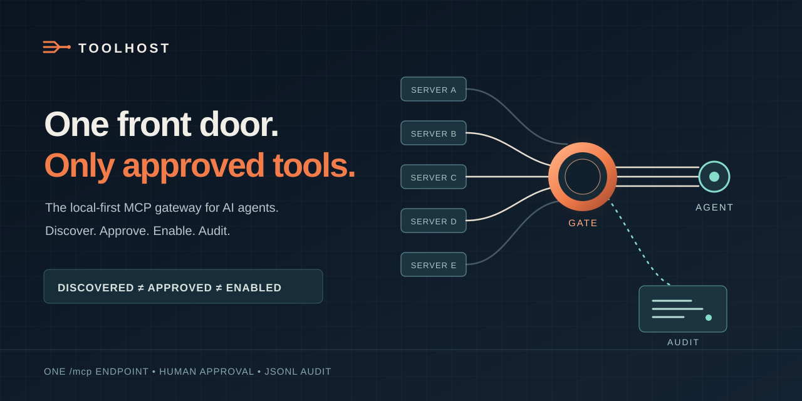

# Toolhost

[](https://github.com/gettoolhost/toolhost-local/actions/workflows/ci.yml)

[](LICENSE)
[](https://github.com/gettoolhost/toolhost-local/releases)

**A local-first MCP gateway that exposes only the tools you approve.**

Toolhost connects AI agents to multiple Model Context Protocol servers through one bearer-gated `/mcp` endpoint. It discovers upstream tools, lets a human approve them, and registers only the enabled subset. Each governed call adds a JSONL audit record.



## Quickstart

From a source checkout with Go 1.26.2. This example backend uses Node.js/`npx`.

```bash
go build -o toolhost ./cmd/toolhost
./toolhost init
# wrote toolhost.json
${EDITOR:-vi} toolhost.json
# add the "fs" backend from the config sample below
./toolhost discover
#   fs__read_file  <upstream description>
./toolhost approve fs__read_file
# approved fs__read_file
./toolhost serve
# toolhost <version> serving 1 tool on http://127.0.0.1:8080/mcp (...)
```

- Point a Streamable HTTP MCP client at `http://127.0.0.1:8080/mcp` with `Authorization: Bearer <token from toolhost.json>`.
- Tool calls append `tool_call` records to `toolhost_audit.jsonl`; rejected `toolhost__call` requests and failed authentication are recorded too.

| Capability | What ships |
|---|---|
| One endpoint | An MCP proxy for upstream stdio, Streamable HTTP, and SSE servers. |
| Access | Downstream bearer check; upstream none, bearer, client credentials, or OAuth with PKCE. |
| Agent controls | `toolhost__search/list/call/enable/disable/request/audit/status` for a pull-based control plane. |
| Tool allowlist | `core.Resolve` registers only discovered, approved, enabled tools; invisible tools have no call handler. |
| Audit log | JSONL events for governed calls, auth failures, agent governance actions, backend errors, and reloads. |
| Local operation | One Go binary, JSON config, no database; config edits hot-reload the live surface. |

## Three-tier gate

| Tier | Owner | Effect |
|---|---|---|
| Discovered | Upstream server | Appears in the catalog; cannot be called yet. |
| Approved | Human, via `toolhost approve` | Eligible for the live surface. |
| Enabled | Agent or human, within approved set | Visible and callable as `backend__tool`. |

- `discovered ≠ approved ≠ enabled`. With no `enabled` list, every approved tool is enabled; `"enabled": []` exposes none.
- `toolhost__request` queues an approval ask. It never approves a tool.

## Config

`toolhost init` writes the bearer token and empty `backends`/`approved` lists. Add the backend below, then run `toolhost discover` and approve the qualified names you need:

```json
{
  "listen": "127.0.0.1:8080",
  "token": "env:TOOLHOST_TOKEN",
  "audit_log": "toolhost_audit.jsonl",
  "backends": {
    "fs": {
      "transport": "stdio",
      "command": "npx",
      "args": ["-y", "@modelcontextprotocol/server-filesystem", "/tmp"]
    }
  },
  "approved": ["fs__read_file"]
}
```

- Default config location: `./toolhost.json` when present, else `~/.config/toolhost/toolhost.json` (`XDG_CONFIG_HOME` honored); `-c <path>` overrides. Verify an install with `toolhost doctor`; register your agent with `toolhost attach <claude|devin|cursor|windsurf>`.
- For this `env:` sample, export `TOOLHOST_TOKEN` before `discover` or `serve`; `init` instead generates a usable token directly. Credential references stay literal in saved config and fail closed when unset.
- Default front door: stateless Streamable HTTP (MCP `2026-07-28`); modern clients can subscribe to list changes. `mode: "stateful"` adds held sessions for pushed `tools/list_changed` with older clients; `serve --stdio` supports spawn-only clients.
- Upstream `http`/`sse` auth, OAuth grants, federation, and per-backend timeouts are documented below.

## Reference

- [Configuration](docs/CONFIGURATION.md) — every `toolhost.json` field.
- [CLI](docs/CLI.md) — commands and flags.
- [Governance](docs/GOVERNANCE.md) — three tiers, meta-tools, requests, audit.
- [Transports](docs/TRANSPORTS.md) — front door modes, upstreams, federation.
- [Authentication](docs/AUTHENTICATION.md) — bearer, upstream auth, `env:` refs.
- [Operations](docs/OPERATIONS.md) — service install, reload, status, troubleshooting.
- [Architecture](docs/ARCHITECTURE.md) — ports, resolver, governed call.

## Deliberately absent

Tenancy, console, rate limiting, schema pinning, credential brokerage beyond the documented upstream auth modes. The scope is one local gateway, one bearer key, and a governed tool surface.
