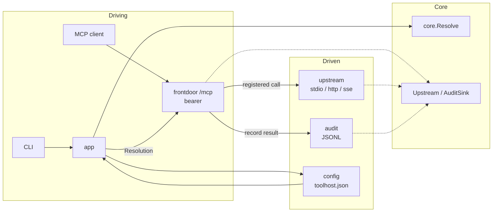
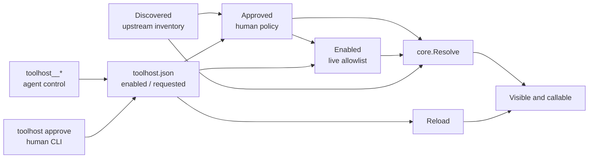
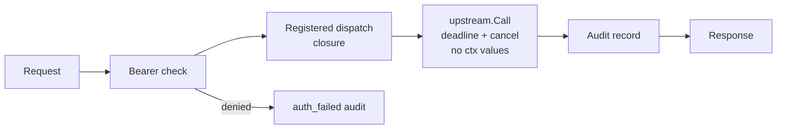

# Architecture

Ports and adapters. Solid arrows show runtime flow; dashed arrows show code dependencies toward `internal/core`.

## Governance

- `toolhost__search`, `list`, and `status` read state; `request`, `enable`, and `disable` write config; `call` dispatches through the live set.
- An absent `enabled` list exposes every approved tool. An explicit empty list exposes none. `Reload` updates the resolved surface; modern subscribers and legacy stateful sessions receive `tools/list_changed`.

## Governed call

- The front door registers only `core.Resolve` output. Each handler closes over its upstream and original tool name; an invisible tool has no handler.
- `upstream.Call` detaches request context values while preserving deadline and cancellation, then applies `call_timeout` (default `60s`, per-backend override).

## Packages

| Path | Role |
|---|---|
| `internal/core` | Domain model, `Upstream` and `AuditSink` ports, sole visibility resolver. |
| `internal/namespace` | `backend__tool` grammar. |
| `internal/frontdoor` | Bearer-gated HTTP or stdio MCP surface, dispatch closures, meta-tools, reload. |
| `internal/app` | CLI use cases, backend orchestration, config watch. |
| `internal/upstream` | MCP client sessions over stdio, Streamable HTTP, or SSE. |
| `internal/config` | JSON load, validation, atomic saves, approval and enablement. |
| `internal/oauth` | Upstream OAuth handlers and grant store. |
| `internal/audit` | JSONL `AuditSink`. |
| `cmd/toolhost` | CLI flags and command dispatch. |

## Decisions that are load-bearing

- **MCP types in the core:** `*mcp.Tool`, `json.RawMessage`, and `*mcp.CallToolResult` are the gateway's domain vocabulary; translation would duplicate the protocol model.
- **One resolver:** `core.Resolve` intersects discovery, approval, and enablement; registering only its output makes invisible tools uncallable.
- **`__` namespacing:** `backend__tool` fits MCP client tool-name constraints; `::`, `.`, and `/` do not.
- **File-backed policy:** `approved`, `enabled`, and `requested` live in `toolhost.json`; atomic saves and a ~1.5s watcher let `Reload` swap the live surface without a database.
- **Stateless default:** independent Streamable HTTP requests need no `Mcp-Session-Id`; 2026-07-28 clients can subscribe to list changes, while stateful mode serves older clients that need held sessions.
- **Context boundary:** only deadline and cancellation cross into upstream calls; downstream protocol-version values could break a legacy upstream.
- **Persistent meta-tools:** the seven `toolhost__*` tools sit outside the resolved set, so reload cannot remove the agent control plane.
- **Bounded calls:** `call_timeout` defaults to `60s`, permits a per-backend override, and never widens a caller's earlier deadline.
- **Stdio front door:** `serve --stdio` reuses the governed surface for spawn-only clients; the owning process replaces bearer authentication.
- **User service:** `install` uses launchd or systemd user units; it needs neither root nor a separate daemon.
- **Ambiguity denies:** bad names skip, duplicate qualified names error, and unreachable backends contribute zero tools.
- **Separated auth:** downstream uses one constant-time-checked bearer token; upstream auth is per backend, with OAuth grants stored outside config.
- **Secret references:** `env:NAME` stays literal in saved config and resolves at the boundary; missing or empty variables fail closed.

## Deliberately absent

An OAuth authorization server of our own, per-principal upstream credentials, tenancy, policy beyond the approve-list, rate limiting, schema pinning, config generations, console, portal, Postgres. Add them when a real need appears.
